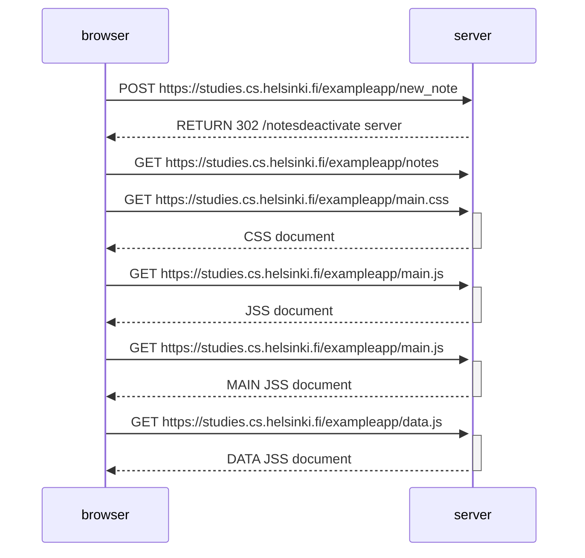

```mermaid
sequenceDiagram
    participant browser
    participant server

    browser->>server: POST https://studies.cs.helsinki.fi/exampleapp/new_note

    activate server
    server-->>browser: RETURN 302 /notesdeactivate server
    browser->>server: GET https://studies.cs.helsinki.fi/exampleapp/notes


    browser->>server: GET https://studies.cs.helsinki.fi/exampleapp/main.css
    activate server
    server-->>browser: CSS document
    deactivate server
    browser->>server: GET https://studies.cs.helsinki.fi/exampleapp/main.js
    activate server
    server-->>browser: JSS document
    deactivate server
    browser->>server: GET https://studies.cs.helsinki.fi/exampleapp/main.js
    activate server
    server-->>browser: MAIN JSS document
    deactivate server
    browser->>server: GET https://studies.cs.helsinki.fi/exampleapp/data.js
    activate server
    server-->>browser: DATA JSS document

    deactivate server
```